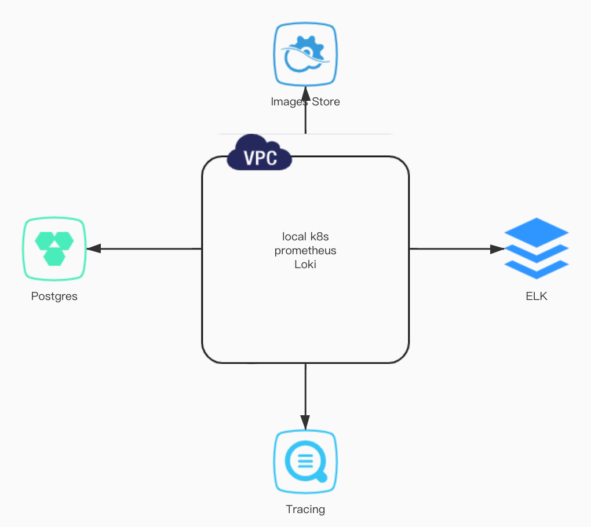
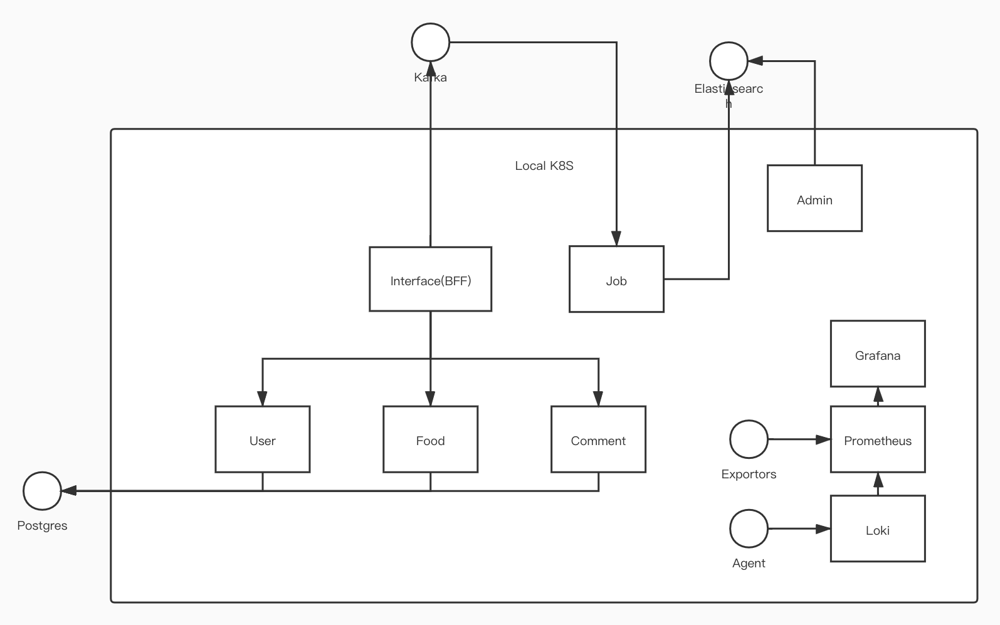

# 云餐厅(一部分)

## 技术栈

### 框架/工具

* kratos
* grpc
* wire
* ent
* docker
* make

### 存储/中间件

* postgres: 阿里云
* kafka: 阿里云
* 容器镜像: 阿里云

### 监控治理

* ELK Stack: 阿里云
* Promethenus: 本地k8s
* Loki: 本地k8s
* 链路跟踪: 阿里云

### 运行

* k8s

## 功能模块

### 管理后台

* 查询评论

### 移动应用

* 注册
* 搜索菜品
* 给喜欢的菜留言打分

## 架构设计

> 注意：尽可能降低本地负担。

### 系统架构

Postgre、kafka、ELK和镜像仓库使用阿里云提供的服务。本地搭建k8s，业务服务、Prometheus和Loki使用搭建的k8s。

### 服务架构

